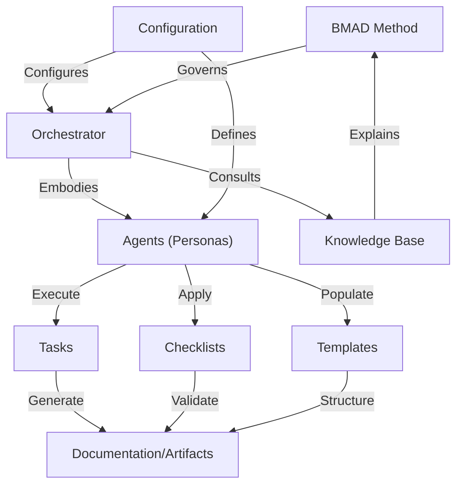

# Tutorial: BMAD-METHOD

The BMAD-Method is like a **structured recipe book** for building software
projects using specialized AI agents. It defines a _workflow_ where different
AI roles (like Product Managers or Developers) collaborate on **tasks**,
using **templates** to create project documents and **checklists** to
ensure quality. A central **Orchestrator** manages the process, guided
by **configuration** and a **knowledge base**, producing valuable
**documentation and artifacts** iteratively.

## Visual Overview

## Chapters

1. [BMAD Method
   ](01_bmad_method_.md)
2. [Orchestrator
   ](02_orchestrator_.md)
3. [Agents (Personas)
   ](03_agents__personas__.md)
4. [Knowledge Base
   ](04_knowledge_base_.md)
5. [Templates
   ](05_templates_.md)
6. [Checklists
   ](06_checklists_.md)
7. [Tasks
   ](07_tasks_.md)
8. [Documentation/Artifacts
   ](08_documentation_artifacts_.md)
9. [Configuration
   ](09_configuration_.md)

---

Generated by [AI Codebase Knowledge Builder](https://github.com/The-Pocket/Tutorial-Codebase-Knowledge).
